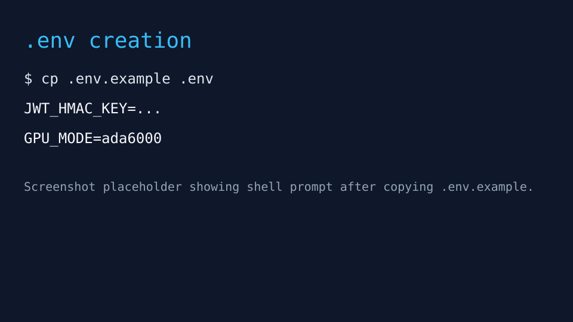
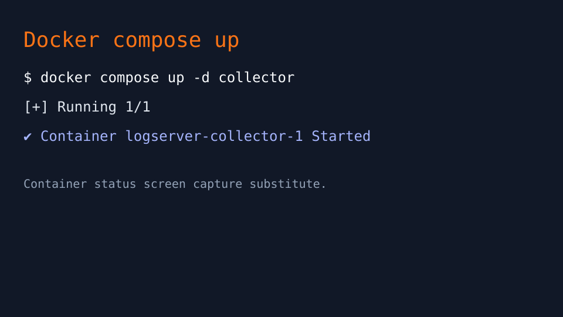
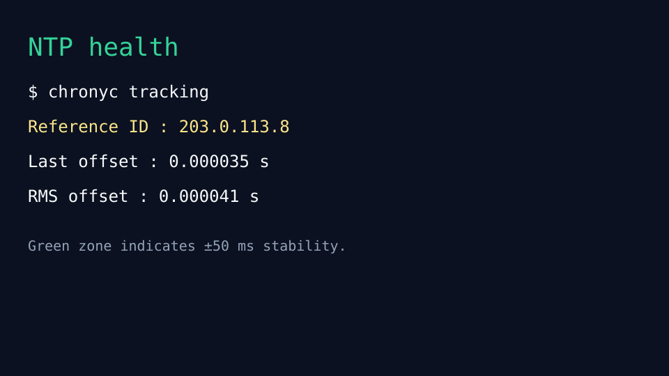
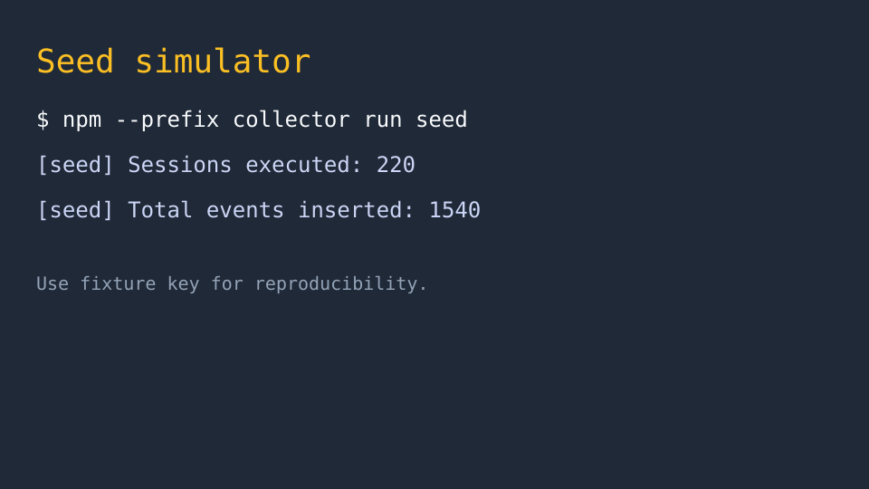
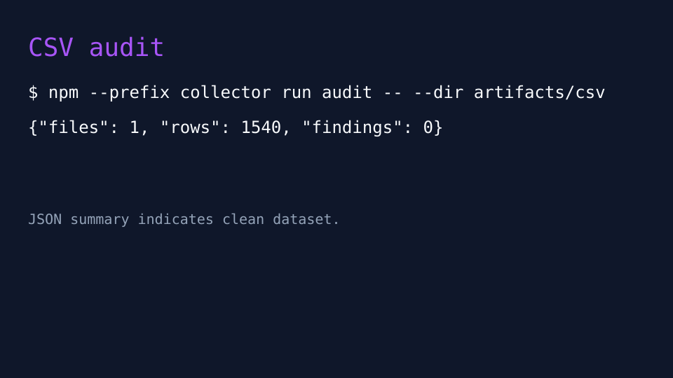
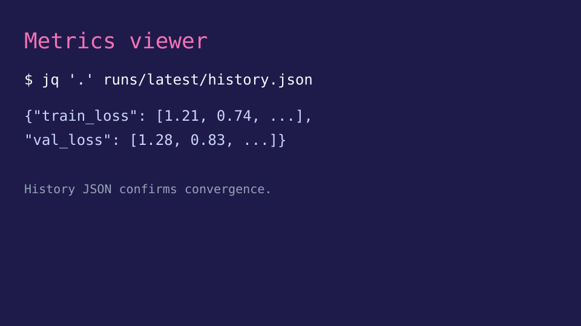
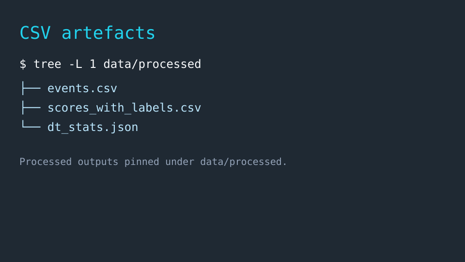

# 運用 Runbook: Δt-aware ログサーバ再現手順

## 0. 目的と前提
- 目的: `.env` 整備から CSV 確認までを 30 分以内で再現し、SRS/README のエンドツーエンド実験を初期化する。
- 対象: 新規参画エンジニア。ホストは Ubuntu 22.04 / Windows11+WSL2、Docker Desktop 4.30 以上、Node.js 20.12.2、Python 3.11。
- 依存: `docker`, `docker compose`, `npm`, `python3`, `chronyc` (または `ntpstat`)、`jq`, `tree`。GPU は `GPU_MODE=ada6000|4060|cpu` で選択。

> 重要: すべてのコマンドはリポジトリルート `/workspace/logserver` から実行すること。

---

## 1. `.env` の作成
1. 雛形をコピーし、Git 管理外の `.env` を作成する。
   ```bash
   cp .env.example .env
   cp collector/.env.example collector/.env
   ```
2. ルート `.env` に以下を追記・確認する。
   ```ini
   JWT_HMAC_KEY=c2VlZF9kZWZhdWx0X2p3dF9obWFjX2tleV8xMjM0NTY=
   GPU_MODE=ada6000  # RTX6000 Ada。4060 を使う場合は 4060 に変更。
   SEED_SESSION_COUNT=220
   ```
3. Windows の場合は LF 改行を維持 (`git config core.autocrlf false`)。



---

## 2. Docker サービスの起動
1. ベースイメージをビルドして collector サービスを起動。
   ```bash
   docker compose build collector
   docker compose up -d collector
   ```
2. GPU モードを確認。
   ```bash
   docker compose exec collector printenv CUDA_VISIBLE_DEVICES
   ```
   - `GPU_MODE=ada6000` → `0`、`GPU_MODE=4060` → `1` が期待値。`none` の場合は未設定で CPU 実行。
3. ログを確認して HTTP 8000 が LISTEN 状態であることを確認。
   ```bash
   docker compose logs -n 20 collector
   ```



---

## 3. NTP 同期の確認
1. ホストで NTP 偏差を測定。
   ```bash
   chronyc tracking
   ```
   または:
   ```bash
   ntpstat
   ```
2. `Last offset`/`Root delay` が ±0.050 秒以内で安定していることを確認。ずれが大きい場合は後述トラブルシュート参照。
3. 記録用に `logs/ntp-$(date -u +%Y%m%dT%H%M%SZ).txt` へ保存。
   ```bash
   chronyc tracking | tee logs/ntp-$(date -u +%Y%m%dT%H%M%SZ).txt
   ```



---

## 4. シードデータ投入
1. collector コンテナが起動済みであることを確認し、Node.js 側で疑似ログを送信。
   ```bash
   npm --prefix collector run seed
   ```
2. 成功時メトリクス
   - `[seed] Sessions executed: 220`
   - `[seed] Total events inserted: >= 1540`
   - 乱数生成器は固定 `0x5eedc0de`、JWT_HMAC_KEY が雛形値と一致しない場合は警告。
3. 実行ログは `artifacts/seed/` に保存（自動生成）。



---

## 5. 品質監査 (Quality Audit)
1. 収集済み CSV（`artifacts/` 配下）を Node 監査スクリプトで検証。
   ```bash
   npm --prefix collector run audit -- --dir artifacts
   ```
2. 期待出力: `{"files": <N>, "rows": >=1540, "findings": 0}`。`findings` が 0 以外の場合は CSV を修正して再実行。
3. 監査レポートは `artifacts/audit/latest.json` に保存（存在しない場合は `tee` で保存）。



---

## 6. メトリクス閲覧
1. Python 環境を有効化し、前処理→学習→スコアリング→閾値→説明を順次実行。
   ```bash
   python -m trainer.scripts.preprocess --config trainer/configs/default.yaml
   python -m trainer.scripts.train --config trainer/configs/default.yaml
   python -m trainer.scripts.score --config trainer/configs/default.yaml
   python -m trainer.scripts.threshold --config trainer/configs/default.yaml
   python -m trainer.scripts.explain --config trainer/configs/default.yaml
   ```
2. 学習履歴と閾値を確認。
   ```bash
   jq '.' runs/latest/history.json
   jq '.' data/processed/threshold.json
   ```
3. Δt 統計は `data/processed/dt_stats.json`、ケースレポートは `data/processed/reports/` に出力。



---

## 7. CSV / 生成物の所在
- 収集段階:
  - 生ログ: `artifacts/<YYYYMMDD>/raw/*.csv`
  - manifest/checksums: `artifacts/<YYYYMMDD>/manifest.json`, `checksums.txt`
- 前処理後:
  - `data/processed/events.csv`, `events.parquet`
  - `data/processed/scores.csv`, `scores_with_labels.csv`
  - `data/processed/threshold.json`, `data/processed/dt_stats.json`
- 学習成果:
  - `runs/<timestamp>/model.pt`, `features.json`, `history.json`, `model_config.json`
  - シンボリックリンク `runs/latest`

```bash
tree -L 1 data/processed
```


---

## 8. トラブルシュート
### 8.1 権限エラー (EACCES / Permission denied)
- 症状: `artifacts/` や `data/processed/` への書き込み失敗。
- 対処:
  ```bash
  sudo chown -R "$USER" artifacts data logs
  chmod -R u+rwX artifacts data logs
  docker compose restart collector
  ```
- Docker ボリュームが root 所有の場合は `docker run --rm -v $(pwd)/artifacts:/mnt busybox chown -R 1000:1000 /mnt`。

### 8.2 ディスク不足
- 症状: `No space left on device`。
- 対処:
  ```bash
  docker system df
  docker system prune -f
  rm -rf artifacts/* data/processed/* runs/*
  ```
- 収集物削除前に `tar czf backup-$(date -u +%Y%m%d).tgz artifacts data/processed runs` で退避。

### 8.3 NTP 不安定
- 症状: `chronyc tracking` で `Last offset` > 0.050s が継続。
- 対処:
  ```bash
  sudo systemctl restart chronyd  # or chrony
  sudo chronyc makestep
  chronyc sources -v
  ```
- コンテナ内はホスト時間に追従するため、ホストの NTP 安定化が必須。安定後にシードをやり直すことで Δt の再現性を担保。

---

## 9. 完了条件チェックリスト
- [ ] `.env` に JWT_HMAC_KEY / GPU_MODE / SEED_* を設定
- [ ] `docker compose ps` で collector が `Up` かつ 8000 LISTEN
- [ ] `chronyc tracking` で ±50ms 内に収束
- [ ] `npm --prefix collector run seed` が成功し 1,540 件以上のイベントが生成
- [ ] `npm --prefix collector run audit` で `findings: 0`
- [ ] `data/processed/scores_with_labels.csv` を生成
- [ ] `runs/latest/` に学習成果を保存

上記が揃えば、Simulink エクスポートや追加実験（閾値比較、説明可能性、PID 対比）に移行可能。
